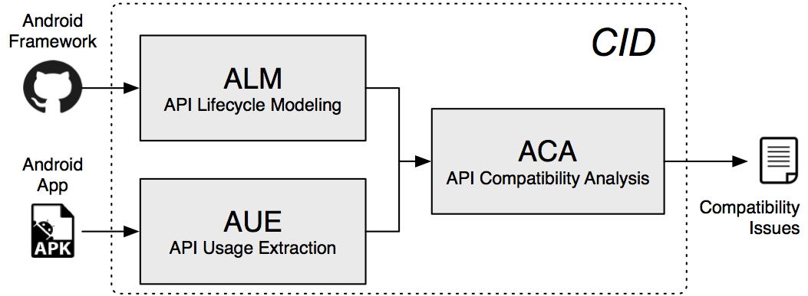

# CiD
Automating the Detection of API-related Compatibility Issues in Android Apps.

The Android Application Programming Interface provides the necessary building blocks for
app developers to harness the functionalities of the Android devices, including for interacting
with services and accessing hardware. This API thus evolves rapidly to meet new requirements for
security, performance and advanced features, creating a race for developers to update apps. Unfortunately,
given the extent of the API and the lack of automated alerts on important changes, Android apps are suffered from API-related compatibility issues.
These issues can manifest themselves as runtime crashes creating a poor
user-experience. We propose in this paper an automated approach named CiD for systematically modelling the
lifecycle of the Android APIs and analysing app bytecode to flag usages that can lead to potential compatibility issues. We demonstrate
the usefulness of CiD by helping developers repair their apps, and we validate that our tool outperforms the state-of-the-art
on benchmark apps that take into account several challenges for automatic detection.

The following figure depicts the three modules of CiD.  
The first module, ALM, builds the API lifecyle model based on a mining of Android framework revision history.
In the second module, AUE, an analysis is performed to locate and extract the usage schema of
Android APIs in an app. This module considers not only core app code, but also any to-be dynamically
 loaded code available in the app package. Finally, the analysis keeps a summary of the conditions under which the extracted APIs could be reached.
Finally, the third module, ACA, evaluates the output of ALM and AUE altogether to flag any potential 
API compatibility-related issue.
We provide further details on the working process of these modules in the remainder of this section.



# Quick Start

CiD takes as input two parameters which are summarized as follows:
* apkPath: A path points to an Android apk (CiD works directly on Android bytecode).
* androidJars: A path points to a directory containing a collection of Android jars, with each one represents each Android platform version.
Interested users can refer to the [android-platofrms](https://github.com/lilicoding/android-platforms) project for possible samples.

Users can launch CiD through the following script:

```
git clone https://github.com/lilicoding/android-platforms
java -Xmx8G -jar CiD.jar $apkPath android-platforms
```

The output of CiD will be a list of compatibility-induced APIs, along with their usages and calling traces.

# Example

Now, we show a concrete example on applying CiD to identify API-related compatibility issues.

```
java -Xmx8G -jar CiD.jar APICompatibility_Basic.apk android-platforms
```

The output of the previous script will be something like below:

```
Declared Min Sdk version is: 10
Declared Target Sdk version is: 25
Declared Max Sdk version is: -1
Collected 5 Android APIs in the primary DEX file
Collected 0 Android APIs in the secondary DEX files
SDK Check:false
Found 0 Android APIs (for forward compatibility) that are accessed with protection (SDK Check)
Found 0 Android APIs (for forward compatibility) that are accessed problematically
Found 0 Android APIs (for backward compatibility) that are accessed with protection (SDK Check)
Found 1 Android APIs (for backward compatibility) that are accessed problematically

==>Problematic_Backward<android.os.storage.StorageManager: boolean isEncrypted(java.io.File)>:[24,25]

[<lu.uni.snt.apicompatibility_basic.MainActivity: void checkStorageEncryption()>]

[<lu.uni.snt.apicompatibility_basic.MainActivity: void checkStorageEncryption()>
, |--> <lu.uni.snt.apicompatibility_basic.MainActivity: void onCreate(android.os.Bundle)> [[]]
]
```
